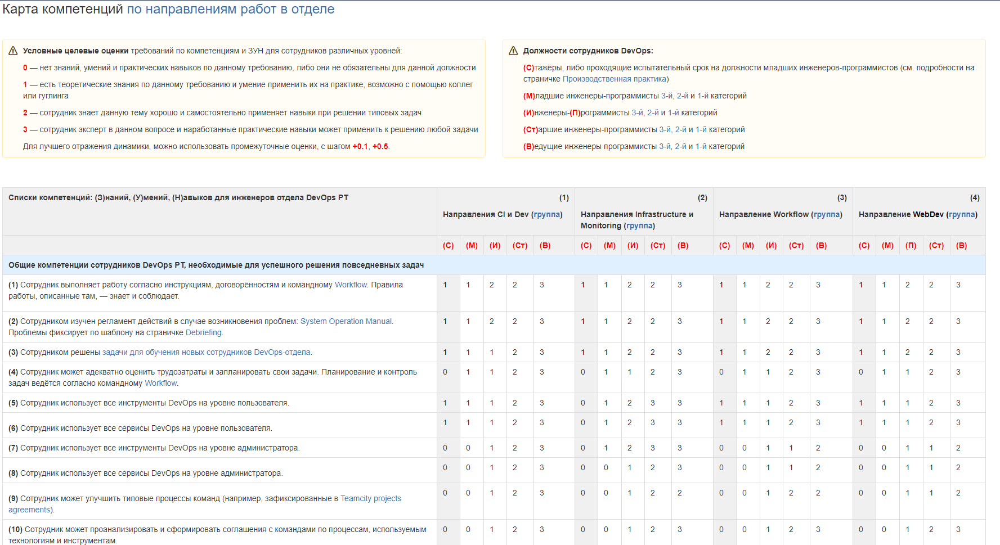

# Карта компетенций инженеров DevOps

Более подробно про то, как мы видим развитие инженеров DevOps, рост их компетенций: знаний, умений и навыков, можно почитать в статье на Хабре: "[Личный опыт: как выстроить карьерный рост в отделе DevOps](https://habr.com/ru/company/pt/blog/501766/)"

В этой инструкции расскажем, что такое "карта компетенций" и как её можно представить с учётом особенностей работы своего отдела.

## Знания, умения и навыки

Когда увеличивается количество продуктовых конвейеров, находящихся на поддержке инженеров DevOps, то растёт и развивается и сам отдел. Становится понятно, что по каждому направлению работ не получится описать однозначную роль и найти подходящего инженера на рынке труда. От инженеров часто ожидают наличия кросс-навыков.

У каждого DevOps-отдела своя специфика работы. Например, очевидно, что команде не нужен мегаквалифицированный программист разработчик ПО для решения CI-задач, но тем не менее CI-инженер должен уметь программировать небольшие модули и скрипты на Python на приемлемом уровне. Точно также бывает не нужен мегаквалифицированный Linux-администратор, но команде DevOps всегда нужен человек с достаточными знаниями ОС Debian или Ubuntu, чтобы он сумел установить на них сборочные агенты GitLab CI, а еще лучше — автоматизировал эти работы через SaltStack, Ansible или другие инструменты.

Так что же должен уметь делать DevOps-инженер? Для начала определимся с понятиями, что такое знания, умения и навыки (сокращенно ЗУН) в общепринятом понимании.

* **Знания** — это основные закономерности предметной области, позволяющие человеку решать конкретные производственные, научные и другие задачи, то есть факты, понятия, суждения, образы, взаимосвязи, оценки, правила, алгоритмы, эвристики, а также стратегии принятия решений в этой области. Знания — это также элементы информации, связанные между собой и с внешним миром.
* **Умения** — под ними понимают освоенный человеком способ выполнения действия, обеспеченный некоторой совокупностью знаний. Умение выражается в способности осознанно применять знания на практике.
* **Навыки** — это автоматизированные действия человека, которые вырабатываются в процессе сознательного выполнения определенных рабочих операций. То, что данное действие стало навыком, означает, что человек в результате упражнений приобрел возможность осуществлять рабочие операции, не делая это выполнение своей сознательной целью.

Если вы сумеете определить ЗУН более конкретно, применительно к разрабатываемым в вашей компании продуктам, то у вас получится общий список компетенций инженеров DevOps или **Карта компетенций**. Без овладения этими конкретными компетенциями у инженера не получится качественно работать в компании. Список может получиться очень длинным, но это не страшно, потому что необходимо учитывать специфику работы сразу по всем направлениям, технологиям, процессам и продуктам.

## Карта компетенций

Карту компетенций проще всего представить в виде таблицы. В ней необходимо описать и классифицировать все требования к инженеру. Выглядеть она может, примерно, так:

Обозначения в таблице должностей сотрудников DevOps (в столбцах):

* (**С**)тажёры, либо проходящие испытательный срок на должности младших инженеров или программистов
* (**М**)ладшие инженеры или программисты
* (**И**)нженеры или (**П**)рограммисты
* (**Ст**)аршие инженеры или программисты
* (**В**)едущие инженеры или программисты

Таблица разбивается на четыре крупные секции (по строкам):

1. **Описание общих компетенций** сотрудников DevOps-отдела, необходимые для успешного решения повседневных задач.
2. **Знания** — специфические, ориентированные на конкретный продукт знания инженеров DevOps.
3. **Умения** — способности применить знания на практике для решения продуктовых задач; умение работать с используемыми в компании инструментами и технологиями.
4. **Навыки** — профессиональное владение используемыми в компании инструментами и технологиями; изученные и доведенные до автоматизма действия при решении типовых задач, не требующие особых усилий для их выполнения.

В ячейках таблицы указываются **качественные оценки**: на каком уровне примерно должен владеть инженер той или иной компетенцией. **Условные целевые оценки** требований по компетенциям и ЗУН для сотрудников различных уровней могут быть, например, такие:

* **0** — нет знаний, умений и практических навыков по данному требованию, либо они не обязательны для данной должности
* **1** — есть теоретические знания по данному требованию и умение применить их на практике, возможно с помощью коллег или гуглинга
* **2** — сотрудник знает данную тему хорошо и самостоятельно применяет навыки при решении типовых задач
* **3** — сотрудник эксперт в данном вопросе и наработанные практические навыки может применить к решению любой задачи

Для лучшего отражения динамики, можно использовать промежуточные оценки, с шагами **+0.1**, **+0.5**. Все требования к определённой должности по умолчанию включают в себя все требования предыдущей должности.

В каждой компании и в каждом отделе DevOps нужно составлять свою аналогичную таблицу, учитывая специфику работы. Здесь также конкретизируются инструменты и технологии, которые обычно очень абстрактно описывают в формальных должностных инструкциях.
