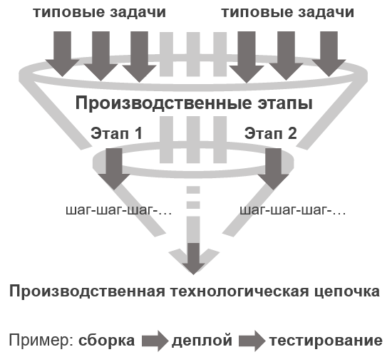
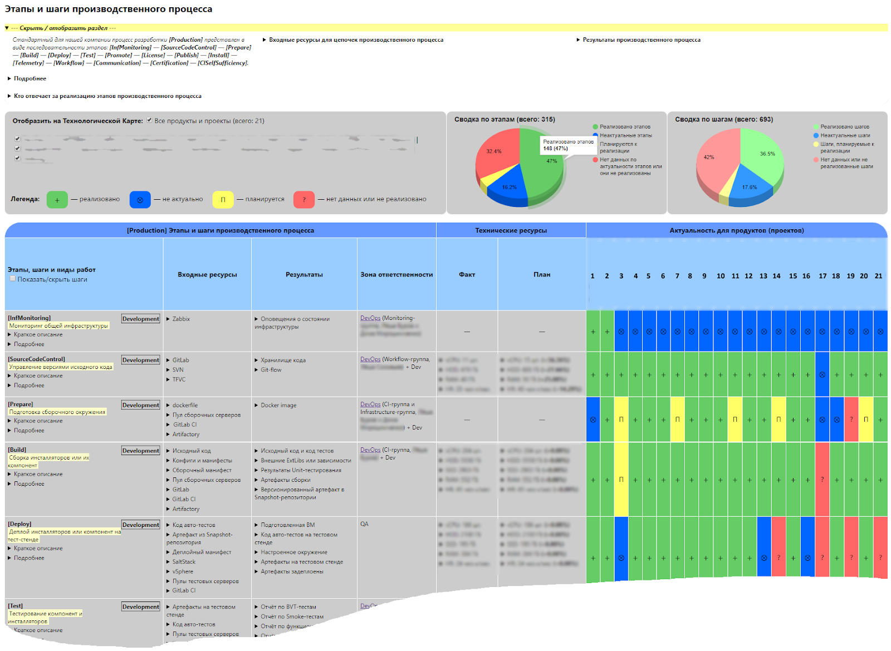
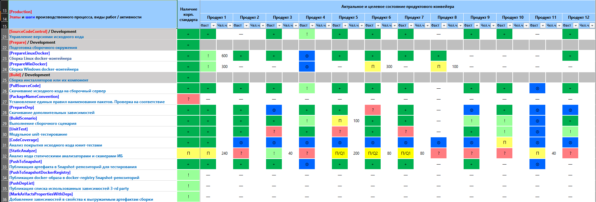

# Технологическая карта производственного процесса

Более подробно про то, как мы пришли к пониманию необходимости использования технологической карты в DevOps процессах, можно почитать в статье на Хабре: "[Управление хаосом: наводим порядок с помощью технологической карты](https://habr.com/ru/company/pt/blog/480754/)"

## Типовые задачи, производственные этапы, производственная технологическая цепочка

В работе DevOps-инженеров быстро накапливается множество однотипных и рутинных операций. От заказчиков в основном приходят так называемые **типовые инженерные задачи**, решение которых уже автоматизировано полностью или частично, не вызывает трудностей у исполнителей и не требует значительных объемов работ. Вы можете сами проанализировать такие задачи и выделить отдельные категории работ, или **производственные этапы**, этапы разбить на неделимые логические шаги, а из нескольких этапов получится **производственная технологическая цепочка**.



Простейший пример технологической цепочки — это этапы сборки, деплоя и тестирования каждого продукта компании. В свою очередь этап сборки может состоять из множества отдельных типовых шагов: выкачивание исходников из хранилища кода, скачивание и подготовка зависимостей и 3rd-party библиотек, юнит-тестирование и статический анализ кода, выполнение сборочного сценария, публикация артефактов в некоторое хранилище и, например, генерация релиз-нотов.

## Классификация этапов

Начинать анализ любого рабочего процесса необходимо с классификации и детализации типовых шагов производственного конвейера. В каждой компании разработчике ПО обычно уже есть своя сложившаяся технологическая цепочка. Также в реальной разработке есть еще и вспомогательные этапы: мониторинг, сертификация продуктов, автоматизация рабочих процессов и другие.  

Если взять все этапы и шаги, попытаться закодировать их тегами и развернуть в одну цепочку, то она получится очень длинной и непонятной, как «хвост питона». Вот пример тегов этапов из реального процесса:

```text
[Production] — [InfMonitoring] — [SourceCodeControl] — [Prepare] — [PrepareLinuxDocker] — [PrepareWinDocker] — [Build] — [PullSourceCode] — [PrepareDep] — [UnitTest] — [CodeCoverage] — [StaticAnalyze] — [BuildScenario] — [PushToSnapshot] — [ChangelogBuilder] — [Deploy] — [PrepareTestStand] — [PullTestCode] — [PrepareTestEnv] — [PullArtifact] — [DeployArtifact] — [Test] — [BVTTest] — [SmokeTest] — [FuncTest] — [LoadTest] — [IntegrityTest] — [DeliveryTest] — [MonitoringStands] — [TestManagement] — [Promote] — [QualityTag] — [MoveToRelease] — [License] — [Publish] — [PublishGUSFLUS] — [ControlVisibility] — [Install] — [LicenseActivation] — [RequestUpdates] — [PullUpdates] — [InitUpdates] — [PrepareEnv] — [InstallUpdates] — [Telemetry] — [Workflow] — [Communication] — [Certification] — [CISelfSufficiency]
```

Это этапы сборки продуктов [Build], их деплоя на тестовые серверы [Deploy], тестирования [Test], продвижения сборок в релизные репозитории по итогам тестирования [Promote], генерации и публикации лицензий [License], публикации [Publish] на сервере обновлений и доставка с них до инфраструктуры заказчиков, инсталляция и обновление компонентов продуктов на инфраструктуре заказчика средствами Product Configuration Management [Install], а также сбор телеметрии [Telemetry] с установленных продуктов.

Кроме них можно выделить отдельные этапы: мониторинга состояния инфраструктуры [InfMonitoring], управления версиями исходного кода [SourceCodeControl], подготовки сборочного окружения [Prepare], управления проектами [Workflow], обеспечения команд средствами коммуникации [Communication], сертификации продуктов [Certification] и обеспечения самодостаточности CI-процессов [CISelfSufficiency] (например, независимости сборок от интернета).

Десятки отдельных шагов можно даже не рассматривать, потому что они могут быть очень специфичными для каждой компании.

## Технологическая карта

Будет гораздо легче понять и окинуть взглядом весь производственный процесс, если представить его в виде так называемой **технологической карты**. Это таблица, в которую по строкам записаны отдельные производственные этапы и декомпозированные шаги, а по столбцам — описание того, что делается на каждом этапе или шаге. Основной акцент стоит сделать на ресурсах, обеспечивающих каждый этап, и разграничении зон ответственности.

Карта — это своеобразный классификатор. Она отражает крупные технологические части производства продуктов. С помощью неё команде DevOps-инженеров будет легче взаимодействовать с разработчиками и совместно планировать внедрение новых этапов автоматизации, а также понимать, какие трудозатраты и ресурсы (человеческие и «железные») для этого потребуются.

Более коротко, технологическая карта — это обобщенная картина производственного процесса, где отражены четко классифицированные блоки с типовой функциональностью. **Самое главное: карта позволяет увидеть весь процесс целиком, крупными кусками с возможностью их детализации.**

В каждой компании карта может выглядеть по своему. Например, вот так:



### Структура технологической карты

Карта состоит из нескольких основных частей:

1. Область заголовков — здесь находится общее описание карты, вводятся базовые понятия, определяются основные ресурсы и результаты производственного процесса.
2. Область общей информации — здесь можно управлять отображением данных по отдельным продуктам, привести сводку и статистику по реализованным этапам и шагам в целом по всем продуктам.
3. Технологическая карта — табличное описание технологического процесса. На самой карте:
    * приводятся все этапы, шаги и их коды;
    * даются краткое и полное описания этапов;
    * указываются входные ресурсы и сервисы, используемые на каждом этапе;
    * указываются результаты каждого этапа и отдельного шага;
    * указывается зона ответственности по каждому этапу и шагу;
    * определяются технические ресурсы, например HDD (SSD), RAM, vCPU, и человеко-часы, необходимые для поддержки работ на данном этапе, как на текущий момент — факт, так и в будущем — план;
    * в ячейках карты для каждого продукта указывается, какие технологические этапы или шаги для него реализованы, планируются к внедрению, неактуальны или не реализованы.

### Шаблон описания производственного этапа или шага

Чтобы не усложнять технологическую карту, более подробное описание каждого этапа или шага производственного конвейера можно вынести в отдельные стандартизированные карточки. Выглядеть эти карточки могут так:

| Элемент технологического конвейера | Описание характеристики                                                                                                                                                                                                       |
|------------------------------------|-------------------------------------------------------------------------------------------------------------------------------------------------------------------------------------------------------------------------------|
| Название или ключ:                 | Любое обозначение в виде [тега]                                                                                                                                                                                               |
| Тип (этап или шаг):                | — / этап / шаг                                                                                                                                                                                                               |
| Вид работы:                        | Короткое, в пару слов, описание видов работ выполняемых на этапе или шаге.                                                                                                                                                    |
| Краткое описание:                  | Короткий дайджест того, что происходит на данном этапе или шаге.                                                                                                                                                              |
| Подробное описание:                | Подробное и детализированное описание этапа или шага технологического конвейера.                                                                                                                                              |
| Входные ресурсы:                   | Какими ресурсами обеспечен данный этап или шаг, что требуется на входе для возможности его полной реализации?                                                                                                                 |
| Результаты:                        | Что получаем по итогу выполнения работ на данном этапе или шаге?                                                                                                                                                              |
| Зона ответственности и контакты:   | Контакты ответственных за реализацию данного этапа или шага.                                                                                                                                                                  |
| Ссылки на корп. стандарт:          | Ссылки на инструкции и описания, скрипты реализации или стандартные инструменты, рекомендуемые DevOps-инженерами компании. Исполнителям должно быть понятно, по каким стандартам нужно реализовывать тот или иной этап и шаг. |

### Шаблон технологической карты

Табличку для техкарты можно создать в любом удобном для вас инструменте. Например, на скриншоте выше представлена карта, которую мы генерим для себя автоматически, в виде веб-странички (HTML + JS + CSS). Но для простоты можно использовать Excel-таблицы, этого вполне достаточно и более понятно большинству коллег.

Вы можете скачать пример технологической карты в Excel по ссылке: [TechnologicalMapExample.xlsx](./.media/TechnologicalMapExample.xlsx). Данные по продуктам приведены в таблице только для примера. Если решите ей воспользоваться, вам нужно будет провести собственную аналитику по вашим продуктам и заполнить ячейки актуальными данными.



### Принятие решений на основе технологической карты

Изучив карту, возможно предпринять некоторые действия — в зависимости от роли сотрудника в компании (руководитель разработки, менеджер продукта, разработчик или тестировщик):

* понять, какие этапы отсутствуют в реальном продукте или проекте, и оценить необходимость их внедрения;
* разграничить зоны ответственности между несколькими отделами, если они работают над разными этапами;
* договориться о контрактах на входах и выходах этапов;
* интегрировать свой этап работ в общий процесс разработки;
* точнее оценить потребность в ресурсах, обеспечивающих каждый из этапов.

## Резюмируя все вышесказанное

Технологическая карта универсальна, расширяема и легко поддерживается. Разрабатывать и сопровождать описание процессов в таком виде гораздо легче, чем в любых других процессных моделях. Кроме того, табличное описание проще для человека, привычней и лучше структурировано, чем, например, функциональная модель.